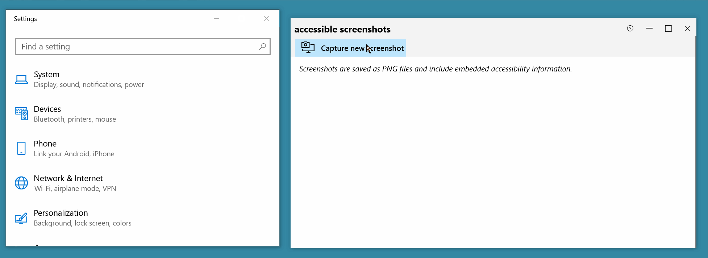

hack project repurposing [accessibility insights](https://github.com/Microsoft/accessibility-insights-windows)

This hack project allows you to take screenshots with embedded accessibility metadata. The accessibility information comes from the [UI Automation](https://docs.microsoft.com/en-us/dotnet/framework/ui-automation/ui-automation-overview) tree and is serialized into the resulting PNG file itself. An example photo viewer for these PNGs is [here](https://github.com/karanbirsingh/photo-viewer)).

